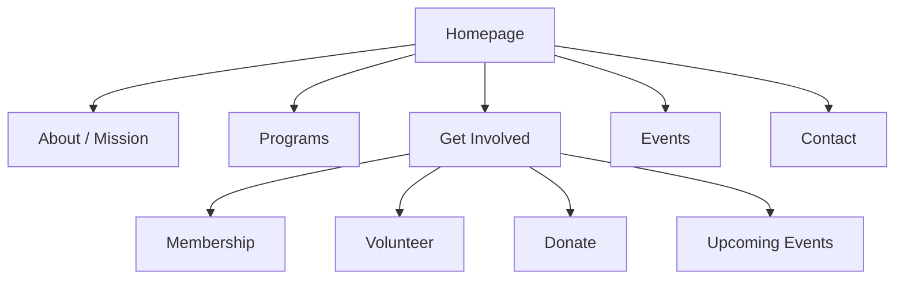

Our team will be improving the Poway Women's Club website to make it easier for visitors to understand the organization, learn about its purpose, and find ways to get involved. The goal is not just to make the website look better, but to make it more useful for the people the club is trying to reach. The website should reflect the club's focus on women's rights, community involvement, and supporting women. Information should be easy to find, the design should feel welcoming and professional, and visitors should not have to spend too much time figuring out where to go.

    <h2>Ideation Infographic Mega Table</h2>
    <table class="ideation-infographic-pwc">
        <thead>
            <tr>
                <th>Category</th>
                <th>Section</th>
                <th>Core Idea</th>
                <th>Evidence / Details</th>
                <th>Scope / Outcome</th>
            </tr>
        </thead>
        <tbody>
            <tr>
                <td class="cat cat-public">Public Mission</td>
                <td>Why it matters</td>
                <td>The club's work on women's rights and community support deserves a website that represents it well.</td>
                <td>Many visitors' first impression of the club comes entirely from the site.</td>
                <td>A clearer, more welcoming site builds trust and credibility.</td>
            </tr>
            <tr>
                <td class="cat cat-public">Public Need</td>
                <td>What people need today</td>
                <td>Visitors need to quickly understand who the club is and how to join in.</td>
                <td>Current sites for small nonprofits often bury mission and involvement info in menus or long pages.</td>
                <td>Surface mission and "get involved" paths within the first screen.</td>
            </tr>
            <tr>
                <td class="cat cat-option">Direction 1</td>
                <td>Information architecture cleanup</td>
                <td>Reorganize navigation around what visitors actually come to do.</td>
                <td>Group content into: About/Mission, Programs, Get Involved, Events, News, Contact.</td>
                <td>No page is more than two clicks from the homepage.</td>
            </tr>
            <tr>
                <td class="cat cat-option">Direction 1</td>
                <td>Problem being solved</td>
                <td>Visitors currently have to hunt for how to volunteer, donate, or join.</td>
                <td>Calls to action are often scattered or missing from the homepage.</td>
                <td>Add a consistent "Get Involved" entry point on every page.</td>
            </tr>
            <tr>
                <td class="cat cat-option">Direction 2</td>
                <td>Visual and tone redesign</td>
                <td>Give the site a warmer, more professional look that reflects the club's values.</td>
                <td>Typography, color palette, and imagery currently feel dated or generic.</td>
                <td>Consistent, welcoming visual identity across every page.</td>
            </tr>
            <tr>
                <td class="cat cat-option">Direction 2</td>
                <td>Trust signals</td>
                <td>Show the club is active and credible: recent events, member stories, impact numbers.</td>
                <td>Static, outdated-looking pages can make an active club look inactive.</td>
                <td>A homepage that feels current builds visitor confidence.</td>
            </tr>
            <tr>
                <td class="cat cat-prototype">Prototype Design</td>
                <td>Homepage framing</td>
                <td>Lead with mission statement, then immediate paths to Learn / Get Involved / Donate.</td>
                <td>Short, plain-language mission summary above the fold.</td>
                <td>Visitors understand the club's purpose in seconds.</td>
            </tr>
            <tr>
                <td class="cat cat-prototype">Prototype Design</td>
                <td>Get Involved hub</td>
                <td>Single page consolidating membership, volunteering, donating, and upcoming events.</td>
                <td>Replaces involvement info currently spread across multiple pages.</td>
                <td>One clear destination for anyone who wants to act.</td>
            </tr>
            <tr>
                <td class="cat cat-prototype">Prototype Design</td>
                <td>About / Mission page</td>
                <td>Explain the club's history, focus on women's rights, and community impact.</td>
                <td>Includes a short "why we exist" narrative and concrete examples of past work.</td>
                <td>Builds emotional and factual connection to the cause.</td>
            </tr>
            <tr>
                <td class="cat cat-macro">Macro Cosmos Selection</td>
                <td>Chosen product direction</td>
                <td>Clarity-First Redesign with a dedicated Get Involved hub.</td>
                <td>Combines simplified navigation, refreshed visual identity, and a single involvement page.</td>
                <td>Transforms the site from a static brochure into a usable entry point for new members.</td>
            </tr>
            <tr>
                <td class="cat cat-macro">Macro Cosmos Selection</td>
                <td>One-sentence pitch</td>
                <td>Redesign the site so any visitor can understand the club and find a way to get involved in under a minute.</td>
                <td>Existing content is largely present; the gap is structure and presentation, not missing information.</td>
                <td>New value comes from organization and clarity, not new features.</td>
            </tr>
            <tr>
                <td class="cat cat-macro">User + Problem</td>
                <td>Primary user</td>
                <td>A community member who has never heard of the club and is deciding whether to get involved.</td>
                <td>Needs to quickly answer: who are you, what do you do, how do I join?</td>
                <td>Design decisions should be judged against this first-time-visitor test.</td>
            </tr>
            <tr>
                <td class="cat cat-macro">Feasibility Matrix</td>
                <td>Stakeholder value</td>
                <td>Directly supports club recruitment and community outreach goals.</td>
                <td>A clearer site can increase membership sign-ups and event turnout.</td>
                <td>High practical relevance for a small, volunteer-run organization.</td>
            </tr>
            <tr>
                <td class="cat cat-macro">Feasibility Matrix</td>
                <td>Team + learning fit</td>
                <td>Matches goals around UX design, information architecture, and front-end development.</td>
                <td>Involves content strategy, responsive layout, and accessible design.</td>
                <td>Strong alignment with web design and usability coursework.</td>
            </tr>
            <tr>
                <td class="cat cat-build">Implementation Flow</td>
                <td>Step 1-2</td>
                <td>Audit existing site content and interview club members on priorities.</td>
                <td>Identify what to keep, cut, or rewrite.</td>
                <td>Grounds the redesign in real club needs, not assumptions.</td>
            </tr>
            <tr>
                <td class="cat cat-build">Implementation Flow</td>
                <td>Step 3-4</td>
                <td>Build new navigation structure and homepage wireframe.</td>
                <td>Test with a few outside readers for clarity within seconds.</td>
                <td>Validates that a first-time visitor understands the club quickly.</td>
            </tr>
            <tr>
                <td class="cat cat-build">Implementation Flow</td>
                <td>Step 5-6</td>
                <td>Build out Get Involved hub and About/Mission page content.</td>
                <td>Include clear calls to action: Join, Volunteer, Donate, Attend an Event.</td>
                <td>Gives visitors a concrete next step every time.</td>
            </tr>
            <tr>
                <td class="cat cat-build">Phased Plan</td>
                <td>Phase 1-2</td>
                <td>Content audit and information architecture, then visual design system.</td>
                <td>Define navigation structure, then colors, type, and layout components.</td>
                <td>Foundation is set before any page is finalized.</td>
            </tr>
            <tr>
                <td class="cat cat-build">Phased Plan</td>
                <td>Phase 3-4</td>
                <td>Build core pages, then polish and test with real users.</td>
                <td>Homepage, About, Get Involved, Events built first; refine after feedback.</td>
                <td>Demo-ready site with a clear, tested user experience.</td>
            </tr>
            <tr>
                <td class="cat cat-build">Later Scope</td>
                <td>Future enhancements</td>
                <td>Event calendar integration, email newsletter signup, member spotlight stories.</td>
                <td>Not essential to the core clarity goal but adds ongoing engagement.</td>
                <td>Possible expansion if timeline allows.</td>
            </tr>
        </tbody>
    </table>

## Site Structure Diagram

