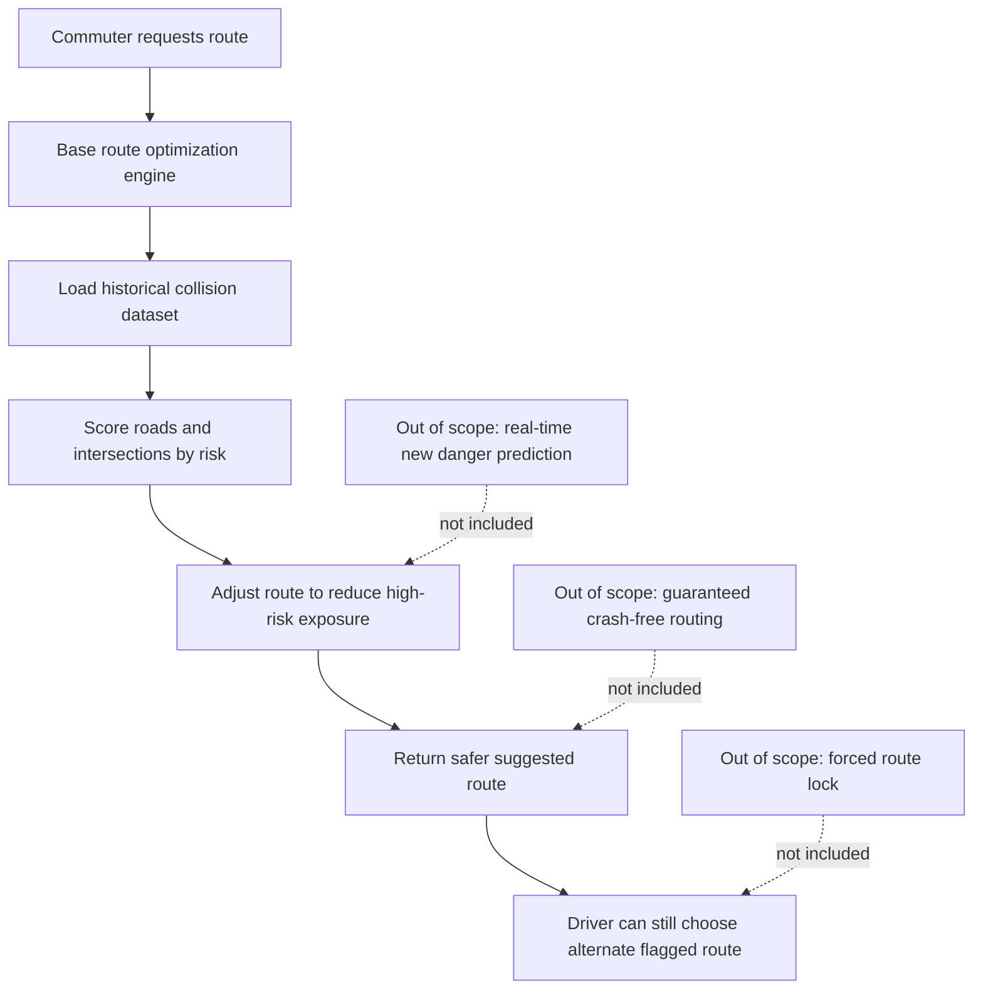

## Project Ideation Overview

We are constructing a big project and currently considering two nonprofit organizations for a website expansion or remake:

1. DeFlock SD
2. SD Auto

This page gathers my core ideas, problem framing, and scope boundaries.

## 1. Why it matters

Privacy and road safety are both community rights, so this project focuses on building public-interest websites that help people make safer and more informed decisions in daily life.

## 2. What Everyone Does and Needs Today

Every day, people commute through busy roads and also rely on public systems that collect data about movement in shared spaces.

For this reason, communities need tools that are transparent, easy to understand, and practically useful.

1. DeFlock SD addresses the need to understand where ALPR systems are active and why unchecked surveillance can reduce privacy freedoms over time.
2. SD Auto addresses the need for route suggestions that account for historically dangerous intersections, not just live hazard pins.

## 3. Why we chose this?

The goal is to design and prototype a nonprofit-focused website experience that can communicate risk clearly and support better public decisions.

For DeFlock SD, the goal is to expand or remake a site that maps ALPR locations and explains the civic and privacy impact.

For SD Auto, the goal is to integrate historical collision risk into route suggestions so commuters can avoid or minimize high-risk roads and intersections.

## Option 1: DeFlock SD

Our project will be to expand upon or remake the website for DeFlock SD, which shows the location of most of the ALPRs in our area.

These license plate readers capture information that is not necessary and do not truly improve public safety to the point that this violation of our rights is acceptable.

It is important to address this issue because if left unchecked, more freedoms of privacy could be lost.

## Option 2: SD Auto

### Big Issue

"Route commuters away from historically dangerous roads and intersections"

### What problem we are trying to solve?

Commuters need routes that actively avoid consistently dangerous roads and intersections, not just see them flagged after the fact, because SD Auto's current hazard reporting only shows live pins on a map and does not factor known high-risk locations into the route it actually suggests.

### How will this help?

We know this works when a commuter requests a route and SD Auto's routing engine calculates a path that avoids or minimizes exposure to known high-crash intersections, using real historical city collision data layered onto the existing route optimization model.

### Out of Scope

This project will not include predicting brand-new dangerous spots in real time, guaranteeing a crash-free route, or removing the driver's ability to choose a flagged route anyway if they want to.

It factors known historical risk into suggestions, not real-time prediction or forced restrictions.

## 4. Website Prototype Description

The prototype will be a structured, content-rich web experience with clear sections for issue framing, map-based insight, and decision support.

Planned prototype components:

1. Landing overview that explains the nonprofit mission and the real-world problem.
2. Interactive map section:
    - DeFlock SD: ALPR location visibility and contextual privacy explanation.
    - SD Auto: Route view layered with historical crash-risk scoring.
3. Decision support panel that explains why a suggested route or flagged area appears.
4. Scope and limitations section that explicitly states what the system does not claim.
5. Evidence and data notes section citing historical collision inputs and civic transparency goals.

## System Idea Diagram

## Why These Two Directions Matter

Both ideas serve a public-interest mission:

1. DeFlock SD focuses on privacy rights and civic transparency.
2. SD Auto focuses on roadway safety outcomes using evidence-driven routing.

Both are strong candidates for a nonprofit-centered capstone web project.
