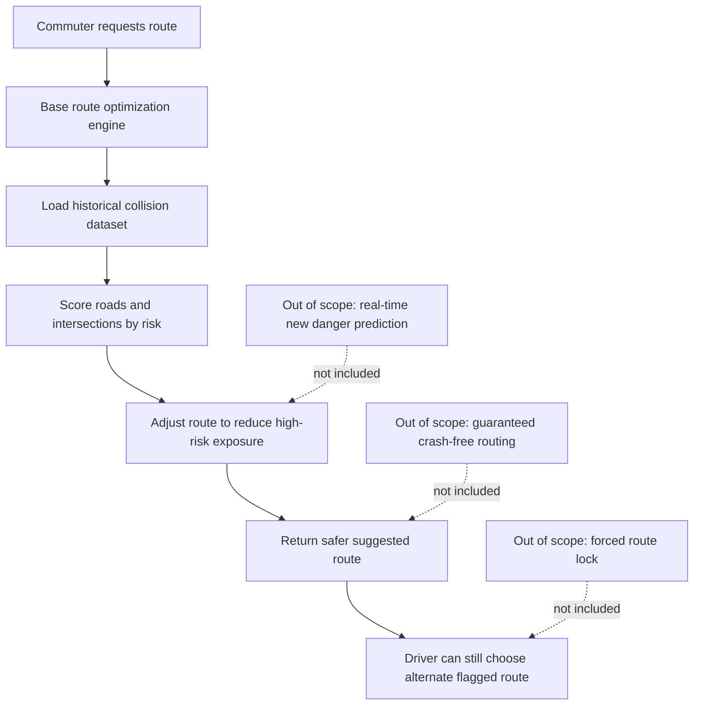

## Project Ideation Overview

We are constructing a big project and currently considering two nonprofit organizations for a website expansion or remake:

1. DeFlock SD
2. SD Auto

This page gathers my core ideas, problem framing, and scope boundaries.

## 1. Why it matters

Privacy and road safety are both community rights, so this project focuses on building public-interest websites that help people make safer and more informed decisions in daily life.

## 2. What Everyone Does and Needs Today

Every day, people commute through busy roads and also rely on public systems that collect data about movement in shared spaces.

For this reason, communities need tools that are transparent, easy to understand, and practically useful.

1. DeFlock SD addresses the need to understand where ALPR systems are active and why unchecked surveillance can reduce privacy freedoms over time.
2. SD Auto addresses the need for route suggestions that account for historically dangerous intersections, not just live hazard pins.

## 3. Why we chose this?

The goal is to design and prototype a nonprofit-focused website experience that can communicate risk clearly and support better public decisions.

For DeFlock SD, the goal is to expand or remake a site that maps ALPR locations and explains the civic and privacy impact.

For SD Auto, the goal is to integrate historical collision risk into route suggestions so commuters can avoid or minimize high-risk roads and intersections.

## Option 1: DeFlock SD

Our project will be to expand upon or remake the website for DeFlock SD, which shows the location of most of the ALPRs in our area.

These license plate readers capture information that is not necessary and do not truly improve public safety to the point that this violation of our rights is acceptable.

It is important to address this issue because if left unchecked, more freedoms of privacy could be lost.

## Option 2: SD Auto

### Big Issue

"Route commuters away from historically dangerous roads and intersections"

### What problem we are trying to solve?

Commuters need routes that actively avoid consistently dangerous roads and intersections, not just see them flagged after the fact, because SD Auto's current hazard reporting only shows live pins on a map and does not factor known high-risk locations into the route it actually suggests.

### How will this help?

We know this works when a commuter requests a route and SD Auto's routing engine calculates a path that avoids or minimizes exposure to known high-crash intersections, using real historical city collision data layered onto the existing route optimization model.

### Out of Scope

This project will not include predicting brand-new dangerous spots in real time, guaranteeing a crash-free route, or removing the driver's ability to choose a flagged route anyway if they want to.

It factors known historical risk into suggestions, not real-time prediction or forced restrictions.

## 4. Website Prototype Description

The prototype will be a structured, content-rich web experience with clear sections for issue framing, map-based insight, and decision support.

Planned prototype components:

1. Landing overview that explains the nonprofit mission and the real-world problem.
2. Interactive map section:
    - DeFlock SD: ALPR location visibility and contextual privacy explanation.
    - SD Auto: Route view layered with historical crash-risk scoring.
3. Decision support panel that explains why a suggested route or flagged area appears.
4. Scope and limitations section that explicitly states what the system does not claim.
5. Evidence and data notes section citing historical collision inputs and civic transparency goals.

## System Idea Diagram

## Why These Two Directions Matter

Both ideas serve a public-interest mission:

1. DeFlock SD focuses on privacy rights and civic transparency.
2. SD Auto focuses on roadway safety outcomes using evidence-driven routing.

Both are strong candidates for a nonprofit-centered capstone web project.

## Macro Cosmos - Route Decision and Smart Commute Planner

### Selection

We propose a **Safety-Aware Route Decision Engine** for Macro Cosmos users, building on the existing route finder and daily routine features. It combines:

- **Idea 1: Safety Score Routing** - score and compare routes using real crash data and hazard reports, instead of returning one unexplained "best" route
- **Idea 2: Smart Commute Planner** - replace the current hour-based routine table with an arrive-by/leave-by calculator that accounts for live conditions

A commuter could pick Fastest, Safest, or Balanced routing, see two or three route options with a real safety score attached to each, and save a commute (like "School, arrive 8:35 AM") that automatically tells them when to leave based on current traffic and hazards.

**One-sentence pitch:** Turn Macro Cosmos from a tool that displays traffic and hazard data into one that actually uses that data to make and explain routing decisions.

### Why we are interested

Our team is interested in transportation, local infrastructure, and practical software that people would actually use day to day. Macro Cosmos already has real infrastructure in place - a working route finder, hazard reports, live traffic data - but none of it currently talks to each other. That's the part we find genuinely interesting to build: not a new app from nothing, but making existing pieces of data actually drive a decision, which is where the real computer science lives.

### User and problem

**Primary user:** A San Diego commuter (student, parent, or daily driver) using Macro Cosmos to get to school, work, or regular destinations.

**Problem:** The current route finder returns a single route with no explanation of why it was chosen, and traffic/hazard data exists on the site but doesn't affect route selection. The Daily Routine feature only stores a route tied to a fixed hour - it doesn't tell the user when they should actually leave based on today's real conditions.

**Need:** A routing system where safety and traffic data measurably change what route gets recommended, and a commute planner that calculates a departure time instead of just displaying a static saved route.

### Why this direction

| Criterion | Justification |
| --- | --- |
| Stakeholder value | Directly useful to anyone who drives regularly in San Diego - connects safety data to an everyday decision, not just a map to look at. |
| Team interest | Matches our interest in transportation and building something with a real, testable algorithm at its core. |
| Technical learning | Involves real datasets, a scoring formula, conditionals, route comparison logic, and time calculations - strong AP CSP content. |
| Feasibility | Builds on Macro Cosmos's existing route finder and hazard data rather than starting from zero; the scoring layer can be built incrementally. |
| Safety | We're not replacing official routing - we're adding a transparent, explainable safety signal on top of existing routes, clearly labeled as informational. |
| Originality | The original project displays hazards and traffic as separate info; our version is the first to make that data actually determine the recommended route. |

### Proposed user flow

1. **Enter trip:** User inputs origin, destination, and picks Fastest / Safest / Balanced.
2. **Compare routes:** App shows 2-3 route options, each with time, distance, and a calculated Safety Score.
3. **See why:** A short explanation shows why the recommended route was chosen over the alternatives.
4. **Save as commute (optional):** User saves the trip with a target arrival time (e.g., "School, 8:35 AM").
5. **Get a leave-by time:** On future visits, the app calculates and displays when the user should leave based on current traffic and hazards.
6. **Confirm hazards:** Users can mark existing hazard reports as still active or cleared, and old reports automatically expire.

### Phased plan

**Phase 1 - Foundation:** Get the existing Macro Cosmos codebase running locally with a proper upstream connection to the original repo. Audit what's actually implemented versus just UI, using the issue documentation as a starting point. Source and clean the real San Diego crash/hazard dataset we'll build the scoring formula on.

**Phase 2 - Core algorithm:** Design and build the Safety Score formula, and wire it into the backend so each route returned by the API includes a score. Implement the Fastest/Safest/Balanced weighting logic.

**Phase 3 - Decision layer:** Build multi-route comparison on the frontend (2-3 options side by side), the "why this route" explanation, and the arrive-by -> leave-by calculation for the Smart Commute Planner.

**Phase 4 - Refinement:** Add hazard confirmation/expiration, polish the frontend display, test the full flow end to end, and prepare the demo.

### Later scope (if time allows)

- Transportation-mode-specific scoring (biking/walking factor in different risks than driving)
- User-adjustable safety preference (e.g., "max 5 extra minutes for a safer route")
- Saved places with default routing preferences attached
